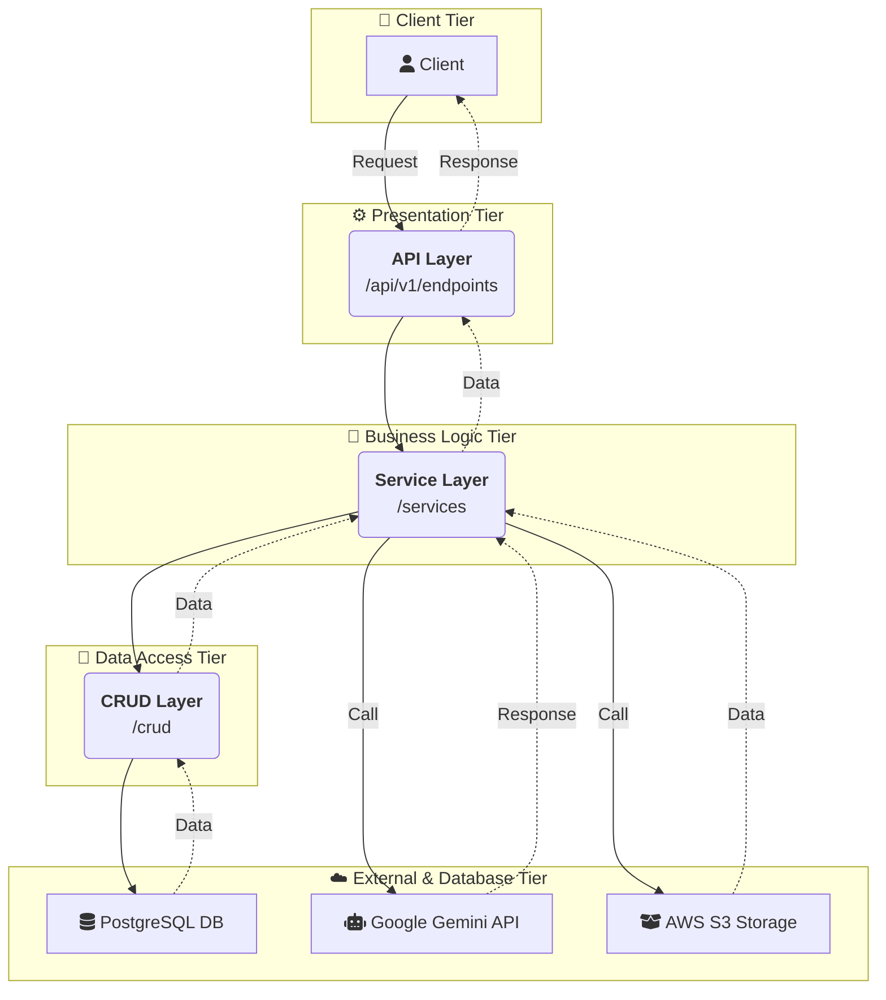
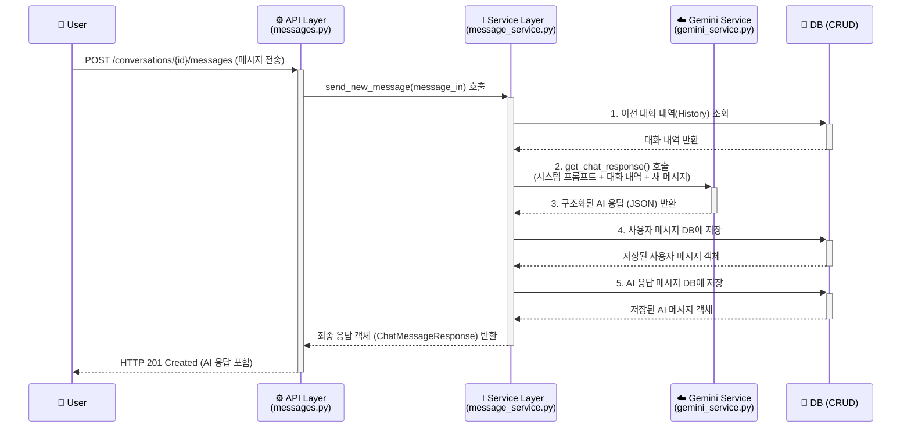
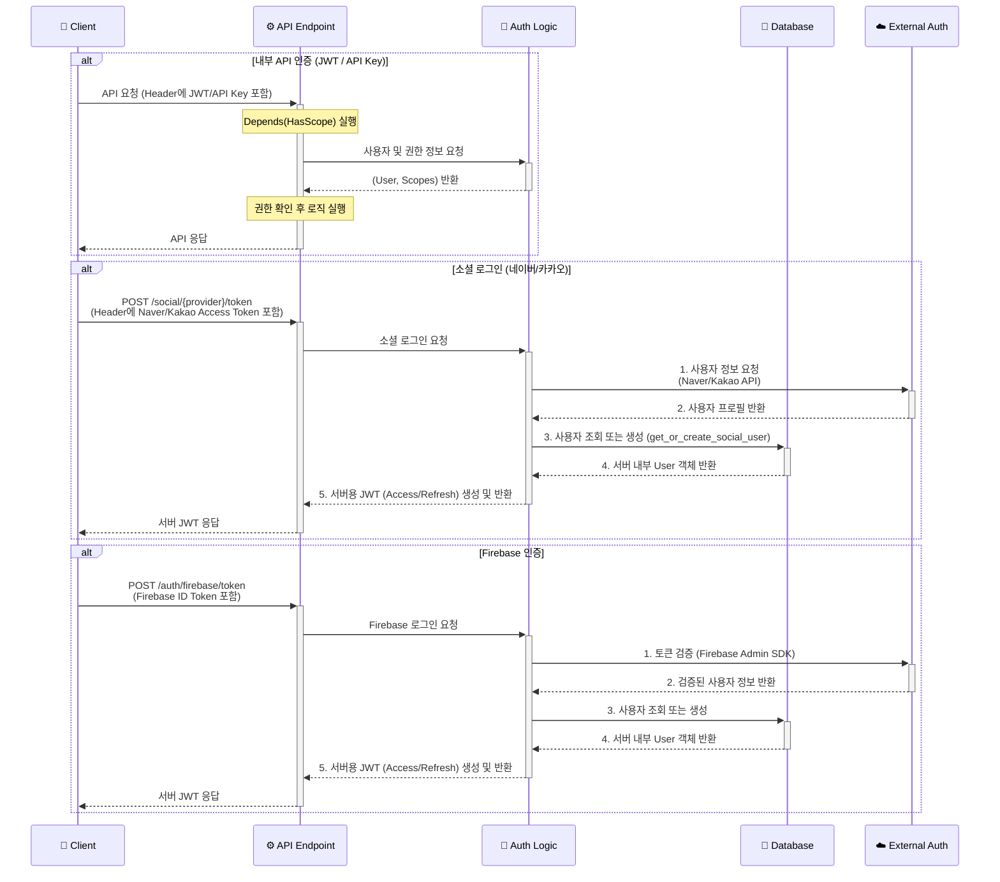

# 🕵️‍♂️ 멍탐정 백엔드 서버

## 멍탐정 의 모든 서버 기능을 담당하는 FastAPI 기반 백엔드 프로젝트입니다.

---
## ✨ 주요 기능 (Key Features)

| 기능 분류 | 설명 | 사용 기술 |
| :--- | :--- | :--- |
| 🚀 **API 서버** | 비동기 처리를 통해 높은 성능을 제공하는 API 서버를 구축했습니다. |    |
| 💬 **AI 채팅** | 사용자와의 자연스러운 대화 및 동적 피싱 시나리오 생성을 담당합니다. |  |
| 🔐 **인증** | 다양한 클라이언트와 사용자를 위한 유연하고 안전한 인증 시스템을 구현했습니다. |      |
| 🗃️ **데이터 관리** | ORM과 마이그레이션 도구를 통해 데이터베이스를 체계적으로 관리합니다. |    |
| 🐳 **개발/실행 환경** | 개발 및 배포 환경을 컨테이너화하여 일관성을 유지하고 이식성을 높였습니다. |    |
| ⚙️ **배포 (CD)** | GitHub Actions를 통해 클라우드 인프라에 애플리케이션을 자동 배포합니다. |  |
| ☁️ **클라우드 인프라** | 확장 가능하고 안정적인 서비스 운영을 위해 AWS 클라우드를 활용합니다. |     |
| 👨‍💻 **관리자 기능** | 서비스의 주요 데이터(사용자, 대화 등)를 관리할 수 있는 API를 제공합니다. |  |
---

## 📊 아키텍처 다이어그램 (Architecture Diagram)



---

## 🌳 폴더 구조 (Directory Structure)

```
meongtamjeongai-backend/
├── 📂 app/                  #  FastAPI 애플리케이션 핵심 로직
│   ├── 📂 api/               # API 엔드포인트 및 라우팅
│   ├── 📂 core/              # 핵심 설정, 보안, 예외 처리
│   ├── 📂 crud/              # 데이터베이스 CRUD(Create, Read, Update, Delete) 함수
│   ├── 📂 db/                # 데이터베이스 세션 관리
│   ├── 📂 models/            # SQLAlchemy DB 모델(테이블) 정의
│   ├── 📂 schemas/           # Pydantic 데이터 유효성 검사 스키마
│   ├── 📂 services/          # 비즈니스 로직 처리
│   └── 📄 main.py            # FastAPI 앱의 메인 진입점
├── 📂 alembic/               # Alembic 데이터베이스 마이그레이션 관리
│   └── 📂 versions/          # DB 변경 이력 스크립트
├── 📂 .github/               # GitHub Actions CI/CD 워크플로우
├── 🐳 Dockerfile             # 프로덕션용 Docker 이미지 빌드 설계도
├── 🐳 docker-compose.yml     # 로컬 개발 환경 구성 (앱 + DB)
├── 📜 requirements.in        # 프로젝트 주요 파이썬 의존성 목록
└── 📜 requirements.txt       # 버전이 고정된 전체 의존성 목록
```

---

## 🛠️ 주요 라이브러리 및 기술 스택

| 분류 | 라이브러리 / 도구 | 역할 및 사용 이유 |
| :--- | :--- | :--- |
| **웹 프레임워크** | `FastAPI` | 고성능 비동기 웹 프레임워크. API 개발 생산성과 성능을 위해 선택했습니다. |
| **웹 서버** | `Gunicorn`, `Uvicorn` | `Gunicorn`이 `Uvicorn` 워커 프로세스를 관리하는 표준 프로덕션 구성으로, 안정성과 확장성을 확보합니다. |
| **데이터베이스** | `SQLAlchemy` | 파이썬 ORM의 표준. 파이썬 코드로 DB를 객체 지향적으로 다루기 위해 사용합니다. |
| | `Alembic` | `SQLAlchemy` 기반의 데이터베이스 마이그레이션 도구. DB 스키마 변경 이력을 체계적으로 관리합니다. |
| | `asyncpg` | `PostgreSQL`을 위한 고성능 비동기 드라이버. `SQLAlchemy`와 함께 비동기 DB 작업을 위해 사용합니다. |
| **데이터 유효성**| `Pydantic` | API 요청/응답 데이터의 유효성 검사 및 설정 관리를 위해 사용합니다. `FastAPI`의 핵심 요소입니다. |
| **인증/보안** | `python-jose`, `passlib` | `JWT` 토큰 생성 및 검증, 비밀번호 해싱 등 보안 관련 기능을 담당합니다. |
| **외부 연동** | `google-genai` | Google Gemini AI 모델과의 상호작용을 위한 공식 Python SDK입니다. |
| | `firebase-admin` | Firebase 서비스(인증 등)와 서버 간 통신을 위한 Python SDK입니다. |
| | `boto3` | AWS 서비스(S3, SSM 등)를 파이썬 코드로 제어하기 위한 공식 SDK입니다. |
| | `httpx` | 외부 API(소셜 로그인, Gemini 등)와 통신하기 위한 최신 비동기 HTTP 클라이언트입니다. |
| **API 문서** | `scalar-fastapi` | 현대적이고 사용하기 편리한 API 문서를 자동으로 생성하기 위해 사용합니다. |
| **파일 처리** | `python-multipart` | `FastAPI`에서 multipart/form-data 형식의 파일 업로드를 처리하기 위해 필요합니다. |
| | `Pillow` | 이미지의 MIME 타입 확인 등 서버 측에서 간단한 이미지 처리를 위해 사용합니다. |
| **성능 향상** | `uvloop` | `asyncio` 이벤트 루프를 대체하여 더 높은 성능을 내는 라이브러리. (Linux/macOS 환경에서 적용) |

---

## 🔬 주요 핵심 기능 및 코드

### 1. 비동기 AI 채팅 응답 처리 흐름

사용자가 메시지를 보냈을 때, 서버 내부에서 Gemini AI API와 상호작용하여 구조화된 응답을 받아 사용자에게 전달하기까지의 과정은 이 프로젝트의 핵심 기능 중 하나입니다. 전체 과정은 비동기로 처리되어 높은 성능을 보장합니다.

**처리 순서 다이어그램**


### 핵심 코드: send_new_message()

```
# app/services/message_service.py

class MessageService:
    # ... (초기화 및 다른 메소드 생략)

    async def send_new_message(
        self, conversation_id: int, message_in: MessageCreate, current_user: User
    ) -> ChatMessageResponse:
        # 1. 대화방 소유권 및 존재 여부 확인
        db_conversation = await self.get_conversation_for_user(conversation_id, current_user)

        # 2. DB에서 이전 대화 내역을 먼저 불러옴
        history = await crud_message.get_messages_by_conversation(
            self.db, conversation_id=conversation_id, limit=None, sort_asc=True
        )

        # 3. Gemini AI에 응답 요청
        try:
            gemini_response, _ = await self.gemini_service.get_chat_response(
                system_prompt=db_conversation.persona.system_prompt,
                history=history,
                user_message=message_in.content or "",
                phishing_case=db_conversation.applied_phishing_case,
                # ... (이미지 처리 등 기타 파라미터)
            )
        except Exception as e:
            # ... (오류 처리)

        # 4. 사용자 메시지를 DB에 저장
        user_db_message = await self.save_user_message(conversation_id, message_in)

        # 5. AI 응답 메시지를 DB에 저장
        ai_db_message = await self.save_ai_message(conversation_id, gemini_response)

        # 6. 최종 응답 객체 구성 및 반환
        return ChatMessageResponse(
            user_message=MessageResponse.from_orm(user_db_message),
            ai_message=MessageResponse.from_orm(ai_db_message),
            suggested_user_questions=gemini_response.suggested_user_questions,
            # ... (기타 응답 필드)
        )
```

### 2. 통합 인증 및 유연한 권한 관리

이 프로젝트는 다양한 인증 방식을 통합적으로 처리하고, API 엔드포인트별로 세밀한 접근 제어를 구현하여 보안성과 유연성을 모두 확보했습니다.

**인증 처리 흐름 다이어그램**

서버는 클라이언트의 요청 종류에 따라 각기 다른 인증 방식을 처리합니다.

1.  **내부 API 인증**: JWT 또는 API 키를 사용하여 서버 내부 자원에 접근합니다.
2.  **소셜 로그인 인증**: 네이버/카카오 등 외부 OAuth 제공자로부터 받은 토큰으로 사용자를 인증하고 서버의 JWT를 발급합니다.



### 핵심 코드: get_or_create_social_user

네이버/카카오 로그인 등 일반적인 소셜 로그인 처리 시, AuthService의 get_or_create_social_user 메소드가 사용됩니다. 이 함수는 소셜 플랫폼에서 얻어온 사용자 정보를 바탕으로 우리 서비스의 사용자를 조회하거나, 없는 경우 새로 생성하는 역할을 합니다.

```
# app/services/auth_service.py

class AuthService:
    # ...

    async def get_or_create_social_user(
        self,
        *,
        provider: SocialProvider,
        provider_user_id: str,
        email: Optional[str],
        username: Optional[str],
    ) -> User:
        """
        소셜 로그인 정보를 받아 사용자를 조회하거나 생성합니다.
        """
        # 1. (제공자, 제공자 ID)로 기존 소셜 계정 조회
        social_account = await crud_social_account.get_social_account_by_provider_and_id(
            self.db, provider=provider, provider_user_id=provider_user_id
        )
        if social_account:
            return social_account.user

        # 2. 소셜 계정이 없으면, 이메일로 기존 사용자 조회
        user = None
        if email:
            user = await crud_user.get_user_by_email(self.db, email=email)

        # 3. 이메일로도 사용자가 없으면, 신규 사용자 생성
        if not user:
            user_in = UserCreate(email=email, username=username)
            user = await crud_user.create_user(self.db, user_in=user_in)

        # 4. 새로 얻은 User 정보에 소셜 계정 정보 연결
        social_account_in = SocialAccountCreate(
            provider=provider, provider_user_id=provider_user_id
        )
        await crud_social_account.create_social_account(
            self.db, social_account_in=social_account_in, user_id=user.id
        )

        return user
```
